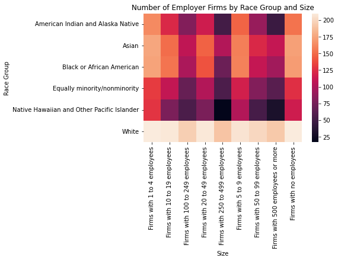
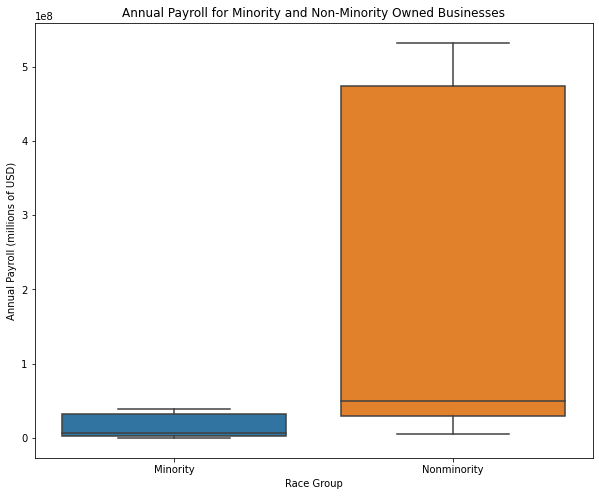
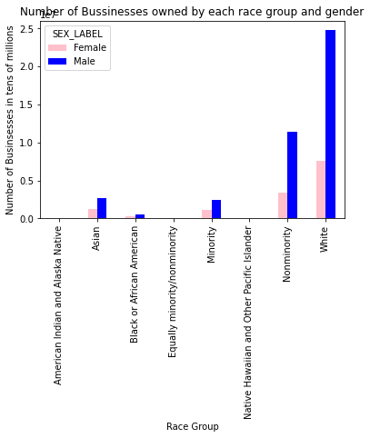

# Exploritory Visualizations of the 2019 Annual Business Survey

This project uses data from the US Census Bureau's Annual Business Survey(ABS). These particular datasets came from the [2019 ABS](https://www.census.gov/data/developers/data-sets/abs.2019.html). 

**Company Summary** shows data for employer businesses by sector, sex, ethnicity, race, veteran status, years in business, receipts size of firm, and employment size of firm. Read the documentation 

**Characteristics of Businesses** shows data for respondent employer firms by sector, sex, ethnicity, race, veteran status, years in business, receipts size of firm, and employment size of firm.

**Characteristics of Business Owners** shows data for owners of respondent employer firms by sector, sex, ethnicity, race, and veteran status.

Find documentation [here](https://www.census.gov/programs-surveys/abs/technical-documentation/api.2019.html)

## Questions

### Which Race Group owns more businesses of various sizes?

### What is the difference in annual payroll between minority-owned and nonminority-owned businesses?

### Which Gender and Race Groups owns the most employer firms?

